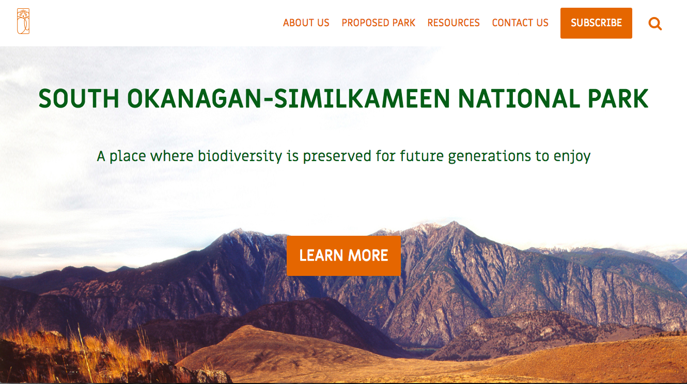
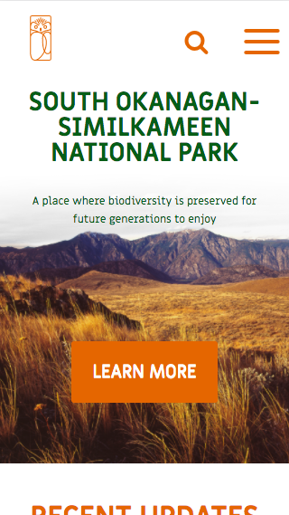

# SOSNPR WordPress Site

Community project with South Okanagan Similkameen National Park Reserve. Custom theme SOSNPR built with WordPress.

## Installation

**1. Download WordPress core**  
Then replace WP-CONTENT existed in core with this WP-CONTENT. 

**2. Database**  
Initialize a new database in you local machine. Change db name, username, and password to match the initalized database. 

**3. Theme activation**  
Open the wordpress dashboard on your local machine. Under the Appearance->Themes, activate SOSNPR Theme. 

**4. Plugins**  
Go to wordpress dashboard Plugins section, install and activate Custom Field Suite and Contact Form 7. 

## Built With

* WordPress, PHP
* Owl Carousel
* Sass
* JQuery

## Tools used when building 

* DPLOY RED 
An FTP/SFTP deployment tool built in node.js, based on DPLOY.
* Gulp
To compile sass and minify files for production

## Authors

* **Colin Matson-Jones**
* **Qingxing Yuan** 
* **Vanessa Yang** 
* **Michael Kim**  

## Acknowledgments

* The RED staff and students who offered tips and advice
* RED Academy UX and UI team for the website design.

## Screenshots

